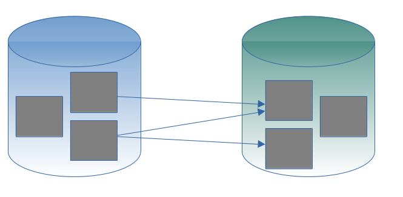

---

layout: default
title: Composite - multiple databases
resource: true
categories: [Structure]

---

## Composite - multiple databases

There are cases in which **phisically distinct databases** are **logically connected**.
And we want access them together, using their relationships to analyse their data.

For example the *orders* are in a database, but the descriptions of the *products* referred by these orders are in a *different* database.

The reason why the tables are in distinct databases can be that:
* they are accessed by different **microservices** 
* they are accessed by different **systems**
* they where designed for different **purposes** but still their data is logically connected.

DBTrarzan is a database browser that uses foreign keys to **traverse** the tables of a relational database.
But it can also traverse the tables of these *logically connected* databases.

How can we do it? There are no foreign keys among tables of distinct databases.
Let's **add them** then!

After we have put all these databases together in a [composite](Compositest-editor),
we define [virtual foreign keys](VirtualForeignKeys) between the tables of these distinct databases.
They are displayed in DBTarzan as [normal foreign keys](ForeignKeyPanel), so it is just to select some rows and double-click the foreign keys as usual to go from one table the table of a different database.

