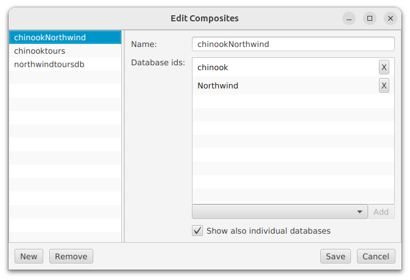

---

layout: default
title: Composites editor
resource: true
categories: [GUI]

---

## Composites editor

With the composites editor it is possible to add, update and remove [composites](Composites).
The editor actually just changes the composites.config file, which is used by dbtarzan to display the list of available composites.

To open the editor, in the "Settings" menu on the top choose "Edit Compostes".
The editor displays on the right side a list of composites. 
Once a composite is chosen on the list, the right side of the editor shows the definition of the composite, which is a list of databases.
The databases must be **already in the databases list** of DBTarzan, which means that connections to them have been created in DBTarzan.

To **add** a new connection, click on the **New** button. A new composite is added to the list, with name <NEW> and the other fields empty.
The new definition is immediately selected, showing its definition on the left. 
The only field with some content is the Name, showing the <NEW> name. <NEW> is just a temporary name that needs to be changed. 
Change the name of the composite and fill the other field, then click on **Save**. The composite is added to the list and immediately displayed on the main window.

The list of databases is created:
* choosing a database from the combo box on the bottom of the list
* pressing the **Add** button.

To remove a database from the list click the **X** button on the right of the database name.

To **update** the definition of a composite:
* choose it in the list
* edit its definition on the right.
* click on the **Save** button. 

To **remove** a composite, select it and click on the button **Remove**. The composite disappears from the list. Clicking on Save, the file is updated and reloaded in the main window without the removed composite. 

