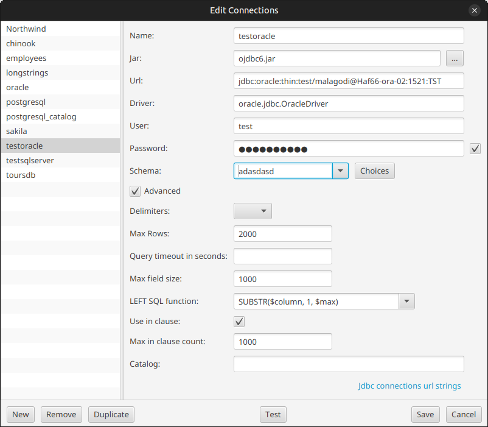

---

layout: default
title: Connections editor
resource: true
categories: [GUI]

---

## Connections editor

DbTarzan includes a connection editor. With it it is possible to add, update and remove connections to databases.
The editor actually just changes the connections.config file, which is used by dbtarzan to display the list of available database connections.

To open the editor, in the "Settings" menu on the top choose "Edit Connections".
The editor displays on the right side a list of database connections. 
Once a connection is chosen on the list, the right side of the editor shows the definition of the connection, in terms of:
* **Name**, the connection identifier
* **Jar**, the jar file with the JDBC driver used to connect to the database.
* **Url**, the JDBC url used to connect to the specific database
* **Driver**, the driver class used to connect to the database, included in the jar file.
* **User**, the user for login account to connect to the database.
* **Password**, the user for login account to connect to the database. Not defining the password here (unchecking the check box on the right side), the password will not be stored and you will need to enter it when connecting to the database. 
* **Schema**. For databases that require the indication of a schema when connecting to them, like for example Oracle and SQL server. When the database allows it, show a list of all available schemas in the combo box pressing the **Choices** button on the right side.

And optionally (generally not needed):
* **Delimiters**. If the database contains tables or columns that have as name reserved words in the database (like GROUP or RULE), queries don't work unless these names are delimited with special characters. These characters vary between databases, but they are either double quotes or squared brackets. 
* **Query timeout in seconds**: for each query (a new tab) sets a maximum limit to the query duration in seconds. This timeout acts both in the query execution itself and in loading the query result. If not specified, this timeout is 10 seconds.
* **Max rows**. The number of rows resulting from queries are limited to 500 by default: you don't want to use local memory, network and database resources to read many table rows, not to mention the queries performance. If you want to see other rows, it is generally enough to change the query parameters or the order of the resulting rows. But there are some cases in which you want to have a larger rows number limit. 
* **Max field size**. Used to improve the performance of queries on tables with large content columns, for example large strings (kilobytes or more). Setting the max field size on a database limits the amount of data (in bytes) read for each column in the normal query, showing only the start of it when it is too long. To see the whole column content display a specific row in the [Vertical row view](Vertical-row-view), which does not limit the size of the columns' content.
* **LEFT SQL function**. If a max field size is given, it is possible to further improve the query performance choosing a LEFT SQL function to be applied in the SQL query to column values that are too large, so that it is the database server itself that prevents large texts to arrive to DBTarzan. These texts are displayed in their entirety only when showing a specific row in the [Vertical row view](Vertical-row-view), This will avoid that the query takes too long time or goes in timeout.  
    To choose the right LEFT SQL function check the SQL query syntax of the database server. A LEFT SQL function returns only the first "max field size" characters from the text field. 
    Queries are logged in DBTarzan log file, so it is possible to troubleshoot them.
    For axample, the query `SELECT id, idtext, name, surname, text FROM largetexts:` becomes and is logged as `SELECT id, idtext, SUBSTR(name, 1, 200), SUBSTR(surname, 1, 200), SUBSTR(text, 1, 200) FROM largetexts`
* **Use in clause**. Used to choose if IN or OR clauses are used for the foreign keys query in this database. DBtarzan uses [foreign keys](ForeignKeys) to traverse a database. Follow a foreign key means querying the destination table with the keys coming from the original table. For this purpose one can choose an IN clause (key IN (v1, v2, v3...)) or a sequence of ORs (key = v1 OR key = v2 OR key = v3...). Normally the IN clause is more effective, but it can be that the database engine does not support it.
* **Max in clause count**. Mandatory when selecting **Use in clause**. There is normally a limitation on the number of values in the IN clause. Some databases accept at most around 1000, 2000 values in each IN clause. To overcome this limitation DBTarzan can express the query as several IN clauses connected with ORs (key IN (...) OR key IN (...) ...). But it needs to know what is the maximum number of values in the IN clause for this database.
* **Catalog**. similar concept to the schema, used to identify a specific database, added to solve issue [#78](https://github.com/aferrandi/dbtarzan/issues/78).

To **update** the definition of a database connection:
* choose it in the list
* edit its definition on the left
* click on the **Save** button. 

To **add** a new connection, click on the **New** button. A new connection is added to the list, with name <NEW> and the other fields empty.
The new definition is immediately selected, showing its definition on the left. 
The only field with some content is the Name, showing the <NEW> name. <NEW> is just a temporary name that needs to be changed. 
Change the name of the connection and fill the other field, then click on **Save**. The connection is added to the list and immediately displayed on the main window.

Connections can be **tested** directly in this editor, selecting a connection from the list and clicking on the **Test** button, which displays a success message if it wes able to connect to the database, a detailed error in the case it was not.
If no password is stored for the database, you need to enter it to test the database.

To **remove** a connection, select it and click on the button **Remove**. The connection disappears from the list. Clicking on Save, the file is updated and reloaded in the main window without the removed connection. 

It is also possible to **duplicate** a connection (button **Duplicate**), because in real life connection definitions tend to be similar (same server, same database with different user, same driver). The new connection will have the same definition as the original but no name.

