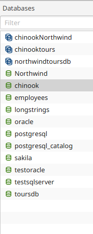
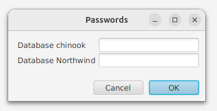

---

layout: default
title: Databases list 
resource: true
categories: [GUI]

---

## Databases list

The database list shows the list of databases (actually connections) to which it is possible to connect,
because their connection has been configured in the [connection editor](Connections-editor).
It also contains the [composites](Composites.md), unions of databases that make sense of display together 
and have been configured in the [connections editor](Connections-editor). 

**Double-clicking** on a database or composite, DBTarzan connects to it and the tables of that database 
or composite are displayed on the right.
If no password was defined for that database or composite in the connection editor,
we need to enter it (or them, for composites) in the password dialog to login.

