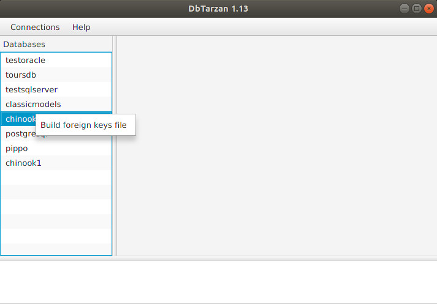

---

layout: default
title: Foreign keys preloading
resource: true
categories: [GUI]

---

## Foreign keys preloading

For some databases, like Oracle, getting the foreign keys can take some time, mainly when the application starts. 
This can make the exploration of the database slow without an apparent reason, and cause irritation to the user.

From version 0.94 there is a context menu in the lists of the databases. 

Right clicking on the name of the database and clicking on _Build foreign keys file_ all the foreign keys of the tables in the database get written in a file.

The file, saved  in the current directory, has as name the name of the database as it appears on the menu and the extension _fgk_ (for "foreign keys").
For example for the database toursdb the name of the file will be toursdb.fgk.

When you click on the menu:
* The log list shows "Writing file _fileName_"
* The foreign keys queried from the database get written in the file.
* When this process is terminated the log list shows ""File _fileName_ written"

This process loads the foreign keys table by table and there is no way to make it faster, therefore it can take a long time (generally tens of minutes) to be finished.
I suggest you to do something else in the meantime.

From the moment the file is available, opening the database automatically loads the foreign keys structure from the file, and dbtarzan uses it instead of reading it from the database.
You can see it because the error list shows the message "Loading foreign keys from the database file _fileName_".

If the database structure changes the file needs to be rewritten.
