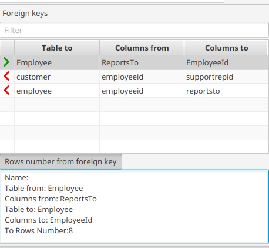

---

layout: default
title: Foreign key panel
resource: true
categories: [GUI]

---

## Foreign key panel

The foreign key panel displays:
* all the [foreign keys](ForeignKeys) owned **by** the current table against other tables.
* all the foreign keys other tables own **against** the current table.

Select one or more rows and **double-click** on one of the foreign keys.
This opens a new tab showing all the rows connected to the selected rows by the foreign key.
Holding the _Ctrl_ button down in the same time will close the original tab.

For example, selecting the album "Led Zeppelin I" and double-clicking on the Tracks foreign keys:

the tracks of the album get displayed:

Each foreign key is displayed with specific [tags](Foreignkey-tags) that show the type of foreign key,

Foreign keys can be **filtered** entering text in the _Filter_ text box on the top. 
Only the keys containing the filtering text in their name, the name of the connected table 
or the names of the fields involved in the foreign key will be displayed.

When databases have complex structures loading the foreign keys can be slow.
To fix this problem try to [preload the foreign keys](Foreign-keys-preloading).
