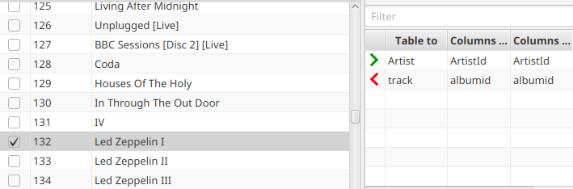

---

layout: default
title: Foreign key panel
resource: true
categories: [GUI]

---

## Foreign key panel

The foreign key panel displays:
* all the [foreign keys](ForeignKeys) owned **by** the current table against other tables.
* all the foreign keys other tables own **against** the current table.

Select one or more rows in the table and **double-click** on one of the foreign keys.
This opens a new tab showing all the rows connected to the selected rows by the foreign key.
Holding the _Ctrl_ button down in the same time will close the original tab.

For example, selecting the album "Led Zeppelin I" and double-clicking on the Tracks foreign keys:

the tracks of the album get displayed:

Each foreign key row shows:
* A **red, left-directed arrow (<)** if the foreign key is owned by this table, a **green, right-directed arrow (>)** if the foreign key is owned by the other table. 
In general this means that for the red arrow the relation is one-to-many (one row of the current table results
in 0-n rows in the other table), for the green arrow if the relation is many-to-one (many row in this table results in one row in the other table).
* the other table's **name**
* the **names of the columns** in this table that are connected to the other table via this foreign key.
* the **names of the columns** of the other that are connected to this table via this foreign key.

For example, from the table COUNTRIES, "< CITIES" means that, selecting one country row and double-clicking on the foreign key, several cities will be displayed.
The same foreign key will be displayed as "> COUNTRIES" from the table CITIES.

Foreign keys can be **filtered** entering text in the _Filter_ text box on the top. 
Only the keys containing the filtering text in their name, the name of the connected table 
or the names of the fields involved in the foreign key will be displayed.

Clinking on a foreign key all the available information about it is shown on the bottom
of the view:
* **Name**: the name of the foreign key, if available.
* **From Table**: the table on this side of the foreign key relation.
* **From Fields**: the fields in the "from" table that are connected to the fields of 
the "to" table by the foreign key relation.
* **To Table**: the table that gets displayed if we double-click on the foreign key.
* **To Fields**: the fields in the "to" table that are connected to the fields of
  the "to table" by the foreign key relation.

Selecting the **Rows number from foreign key** radio button the information panel shows also the
field **To Rows Number**, the number of rows displayed in the table displayed
if we double-click on the foreign key. Keeping the radio button selected this information
is displayed also clicking on another foreign key. The purposed is, when exploring a 
database, to avoid following foreign keys with no meaningful information (0 rows, for example).

When databases have complex structures loading the foreign keys can be slow.
To fix this problem try to [preload the foreign keys](Foreign-keys-preloading).
