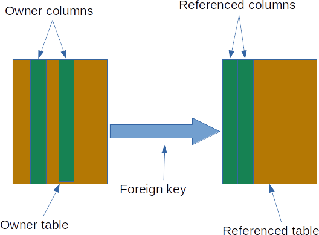
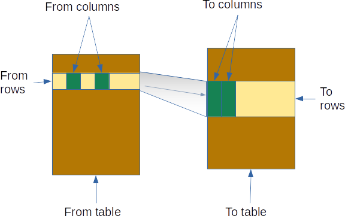

---

layout: default
title: Foreign keys
resource: true
categories: [Structure]

---

## Foreign keys

DBTrarzan is a database browser that uses foreign keys to **traverse** the tables of a relational database.
Foreign keys are used in the database as constraints, but they contain information about the relationships among tables.
DBTarzan sees a foreign key as a directed relation between 2 tables, composed by:

- a **owner table** (the table containing the foreign key, also called child)
- a **referenced table** (the table referenced by the foreign key, also called parent)
- the **owner columns**, the columns in the owner table that are part of the foreign key
- the **referenced columns**, the columns in the referenced table that are part of the foreign key 

DBTarzan uses the foreign key to **traverse the database**:

- from the **owner table** to the **referenced table** 
- also in the **opposite direction**, from the **referenced table** to the **owner table**.

This happens in the following way:

- The user **selects** (checks) one or more rows in a table (we call it **from table**)
- The user **activates** the foreign key to a table that we call the **to table**
- For each selected row, DBTarzan:
    - reads the **values** of the foreign key columns in the **from table**, 
    - in the **to table** it finds all the rows that match with their foreign keys columns values the **from table** values.
    - it shows these rows in the result. 

