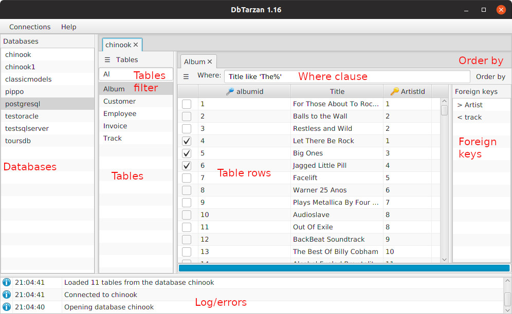

---

layout: default
title: GUI structure
resource: true
categories: [GUI]

---

## GUI structure

1. The **databases** list, as read from the configuration. When you open a database, a new database tab is added.
2. The **tables** list for the selected database. When you open a table, a new [table tab](Tags) is added.
3. The **tables filter** filters the names in the tables list, showing only the ones with names and columns matching the filter text. 
4. The **table rows** in a table tab. 
5. The **foreign keys** in a table tab. Selecting some table rows and double-clicking in a [foreign key](Tags), a new table tab is added with the rows in the related table connected to the selected rows.
6. The **where clause** in a table tab. Writing an SQL where clause a new table tab is added with the result of filtering the original table with the clause.
7. The **order by** in a table tab. Choosing the [order-by](Order-By) column or columns, a new table tab is added with the result of sorting the rows of the original table with the order by clause.
8. The **errors** that are displayed when something goes wrong, together with other log: wrong where clause, problems connecting to a database. 

Using the table tab menu the [Vertical row view](Vertical-row-view) can be displayed on the rigth side of a table.

Under the table tab there is a **progress bar**. It progresses when table rows have been loaded and when foreign keys have been loaded.
