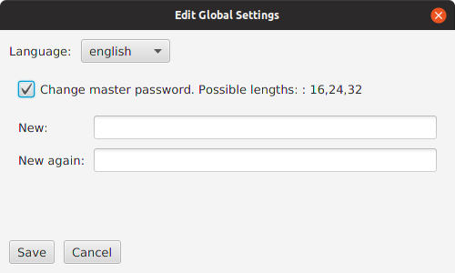

---

layout: default
title: Global settings
resource: true
categories: [GUI]

---

## Global settings

The global settings dialog is used to change the settings of DBTarzan that are related to the whole application, not to a specific database connection.
To open it, in the "Settings" top menu choose "Global Settings".
The following dialog opens:

To change the application language (menus, buttons, log) choose the language in the **Language** combo.

To change the [master password](Master-Password) enable the checkbox **Change master password**, If a master password already exists it has to be written in the **Original master password** field, the new master password has to be written twice in the **New** and **New again** fields. 

When you are finished press the the **Save** button. If you confirm that you want to save, the changes get saved. 
The changes will be operational after you restart the application.

If instead you changed your mind, press the **Cancel** button, which, after asked you to confirm, will close the dialog loosing the changes. 
