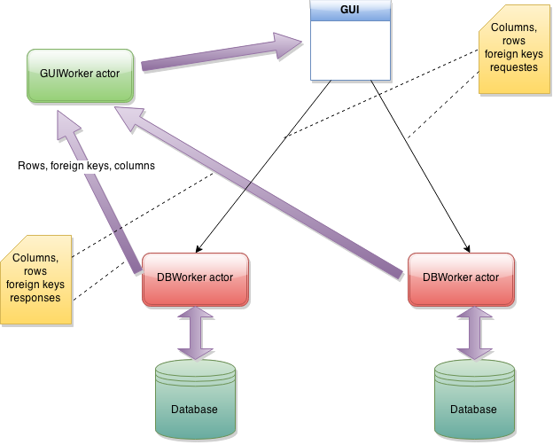

---

layout: default
title: Internal structure
resource: true
categories: [Structure]

---

## Internal structure

DbTarzan is modeled to avoid synchronous calls to the database. Everything is done **asynchronously**, with messaging among Akka actors.
DbTarzan does not user futures, but simple Akka actors.

In this way the GUI is very responsive. The GUI never blocks, when waiting for the result of a query the user can start other queries.
