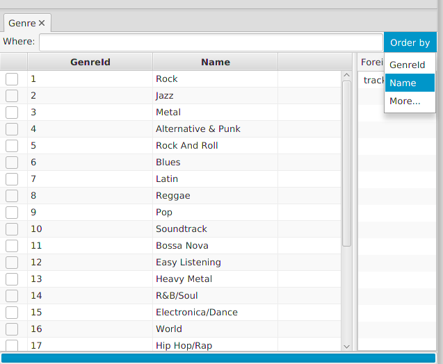
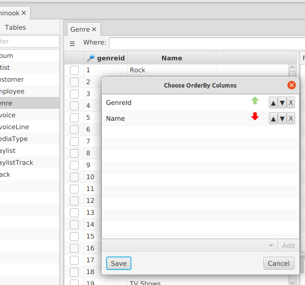

---

layout: default
title: Order by
resource: true
categories: [GUI]
 
---

## Order by

It is possible to open a new tab from an existing one applying an ORDER BY clause to the tab's query.
This can be beneficial in all cases in which the table contains more than 500 rows (which means that dbtarzan cannot load it completely) and there is not a known WHERE clause that can be used to show only the meaningful rows.
In this case applying ORDER BY clauses can help exploring the data in the table. 

To apply an ORDER BY clause to the existing tab use the **Order By** menu on the right:

Choosing one column name from the menu and the **order direction** from the submenu, the new tab will be ordered by that column in the selected order, ascending or descending.
This can be enough in most cases.
If instead you need to sort the table using multiple columns, clicking on the menu's **More...** option, a dialog opens:

The dialog contains a list of order by columns, in the order in which they get applied in the final order by clause.
Eech line contains the name of the column and the direction (arrow up for ascending, arrow down for descending).

To add a new column choose it from the combo box in the bottom, with the desired direction, and press the **Add** button. 

To move a row up or down in the list, click the **arrow-up** or **arrow-down** button in the row you want to move.  

To remove a row from the list, click the **X** button in the row you want to remove.

To apply the order by columns to the current tab press the **Save** button. 
The **Cancel** button closes the dialog without generating a new tab.

If the Save button is not enabled, it means that no change has been made.
If the fields selection is empty, a confirmation dialog is displayed when saving. 
