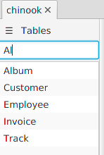
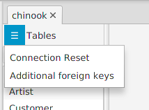

---

layout: default
title: Table list 
resource: true
categories: [GUI]

---

## Tables list

The tables list shows the list of tables in a database or [composite](Composites).

If the tables of a single database are displayed, they are identified by their name,
if the tables of a composite are displayed, thay are identified by the database name + table name.

**Double-clicking** on a table, the table is [displayed](Table-tab) on the right. 

The **table filter**, a text box on the top of the table list allows to filter the tables.

Writing something in the text box, the list shows only:
- the tables with names containing the text.
- the tables with columns names containing the text.

This can be useful with databases containing many tables, or when you are looking for a speciific topic in the database.

If the connection to the database has been lost, it can be **resetted** from the menu.

From the same menu, To add [additional foreign keys](AdditionalForeignKeys) can be added to the database or composite.