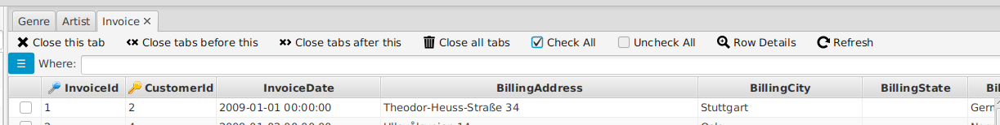

---

layout: default
title: Table tab
resource: true
categories: [GUI]

---

## Table tab

A table tab is a tab that contains some table rows which are:
- **the content of a database table**, if opened directly from the tables list.
-  or the **result of a query**, when as a result of applying [foreign keys](ForeignKeys), [where clauses](Where-clause) or [order by](Order-By) from other tabs.

The [tag on the tab](Table-tags) gives some information about the content of the table.

### Open new tabs

From this tab: 

- selecting some rows and double-clicking on one [foreign key](ForeignKeys) on the right you can open new tab containing the **rows related** to the selected ones in the table connected by the selected foreign key.
- using the [where clause](Where-clause) on the top you can open a new tab containing a **subset** of the results.
- using the [order by](Order-By) menu on the top right, you can open a new tab with the same result **ordered** in a different way.

### Menu

The menu by on the left of the where clause gives the possibility to:
 - **close** this or other tabs
 - **check** or uncheck all rows 
 - open the [row details](Vertical-row-view) or vertical row, to have a better view of the **details** of a specific row.

All the menu items have a **key combination** associated.   
For example to **close this table tab** you just have to click Ctrl-Delete.

### Information

On the bottom panel on the right you can see [information](TableInformation) about the query that generated the table and its structure
