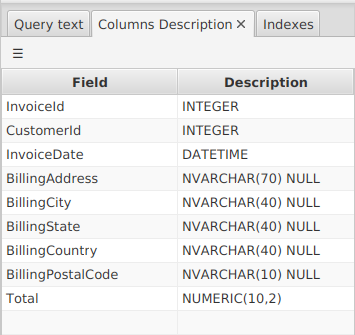

---

layout: default
title: Table Information
resource: true
categories: [GUI]

---

## Table Information

When you open a table tab, DBTarzan shows the content of the table, and on the right a panel with the **foreign keys** of that table.
Under the foreign keys table there is another panel, showing **additional table information**.
This panel is divided in two tabs:
  
### Table Query

Shows the **query** that extracted the content displayed in the table.
It can be **copied**, just selecting it and copying the selection.
So you can for example run the query in **other applications**.

### Table Fields

Shows the structure of a table in terms of its **fields**, e.g. the name of the fields and their type.
This can be used for example to write a program that reads the content of the table; 
you need to know for example if the fields are texts of numbers, if they are nullable.