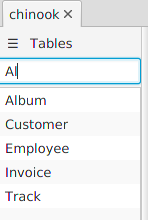

---

layout: default
title: Tables names filter
resource: true
categories: [GUI]

---

## Tables names filter

A text box on the top of the table list allows to filter the tables.
Writing something in the text box, the list shows only:
- the tables with names containing the text.
- the tables with columns names containing the text.

This can be useful with databases containing many tables, or when you are looking for a speciific topics in the database.
