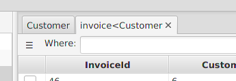

---

layout: default
title: Tags 
resource: true
categories: [GUI]

---

## Tags

### Table tab tag

Each tab added by opening a table or following a relation has a tag, which is the following:
* The name of the **table**
* If the table has been opened from another table (original table) using a **foreign key**, it is in the format **[TABLE] < [ORIGINAL TABLE]**. 
* If the tab is the result of a filter in the **where** text box in another tab, the tag last character is a **star** (*).

Examples:

CITIES  
the tab shows the table CITIES

CITIES < COUNTRIES  
the tab shows the rows of the table CITIES resulting from clicking on the foreign key that connects COUNTRIES to CITIES

CITIES *  
the tab shows the rows in the table CITIES that result from filtering the rows of the table with a where clause.

### Foreign key tags

The [Foreign Keys panel](GUI-Structure) on the right side of a table shows a list of foreign keys that goes from that table to other tables in the database, including the [additional foreign keys](AdditionalForeignKeys).
Each foreign key is displayed as follows:

* **<** if the foreign key is owned by this table, **>** if the foreign key is owned by the other table. In general this means that for **<** the relation is one-to-many (one row of the current table results in 0-n rows in the other table), for **>** if the relation is many-to-one (many row in this table results in one row in the other table).
* the other table's **name**
* if there are more than one foreign keys between this and one specific table, the **names of the fields** in this table that are connected to the other table via this foreign key.  

For example, from the table COUNTRIES, "< CITIES" means that, selecting one row and double-clicking on the foreign key, several cities will be displayed.
The same foreign key will be displayed as "> COUNTRIES" from the table CITIES.

If there are two or more foreign keys to CITIES in the table COUNTRIES (which is not uncommon), they will be displayed with their fields names, for example "< CITIES (CAPITAL_ID)" and "< CITIES (LARGESTCITY_ID)",  to distinguish them. If it is still not possible to distinguish two foreign keys, their tooltip text contains a complete desciption, with the involved fields on both tables:

