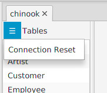

---

layout: default
title: Troubleshooting
resource: true
categories: [Other]

---

## Troubleshooting

Dbtarzan reports many errors on the [log view](GUI-Structure) on the bottom of the window. Double-clicking on the error row opens a dialog box that shows the complete stacktrace of the exception; from there it is possible to copy the error text, so that it can be further examined or reported.
Typically problems arise when connecting to a database for the first time. 

If this is not enough you can see additional errors and logs running the executable file from the command line, if it is possible, or running the one-jar version with "java -jar dbtarzan_XXX-one-jar.jar".

If you have any non-trivial problem, please report it as an [issue](https://github.com/aferrandi/dbtarzan/issues).

If opening tabs is very slow it can be that reading the foreign keys from the database is too slow. [Preloading the foreign keys](Foreign-keys-preloading) is the solution in this case.

A special case is when the database closes automatically the connection after a certain period to free resources (e.g. Azure SQL Server). To reopen the connection, click with the right mouse button on the **Tables** label and click the **Reset database connection** context menu. The connection will be reopened.

