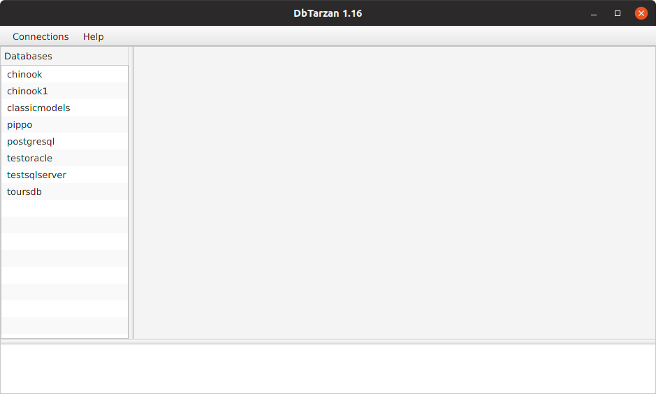
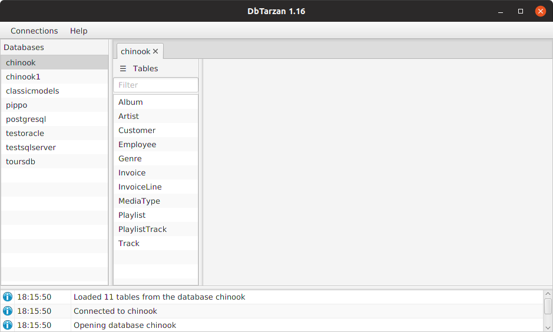
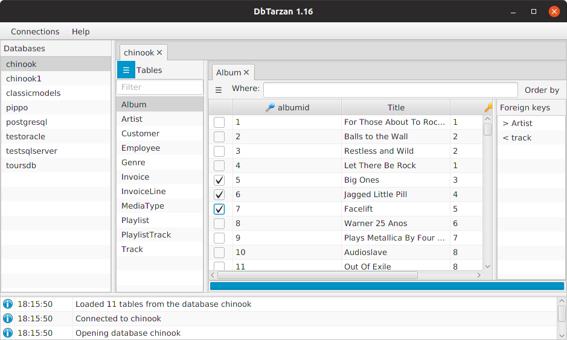
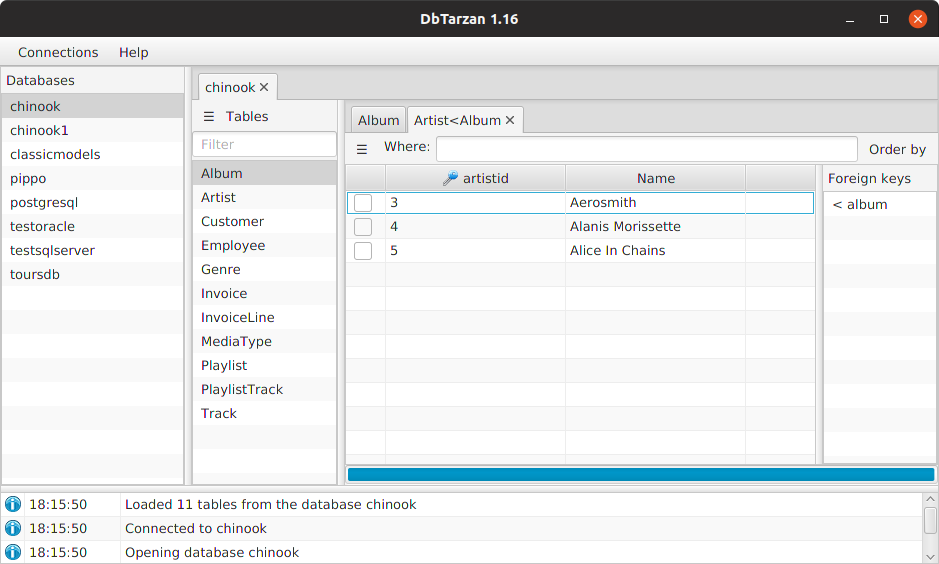
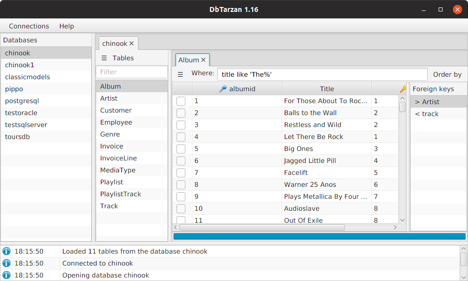
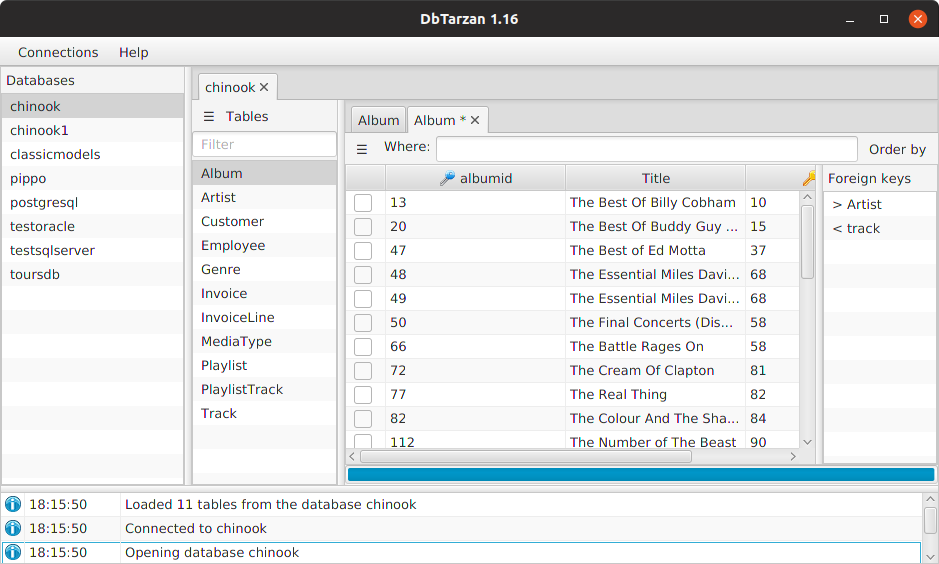

---

layout: default
title: Usage
resource: true
categories: [GUI]

---

## Usage

Open a database from the list (read from the [Configuration](./The-database-connections-configuration-file)), double-clicking on it.
If the database list is empty, add a database with the [Connections Editor](Connections-editor).
This example uses the Sqllite demo database, Chinook.

You get a list of the **tables** contained in the database:

The list of tables can be [filtered](./Tables-Names-Filter). Open a table double-clicking on it:

If you select some rows (like in the previous image) and double-click on a [foreign key](ForeignKeys), you open the table related to the original one through the foreign key, showing the rows related to the originally selected rows. Keeping the Ctrl button pressed when double-clicking the foreign key the current tab is closed when opening the new one.

You can select specific rows of the table specifying a [where clause](Where-clause):

DbTarzan shows the original rows in the table filtered with the where clause: 

Every time you follow a foreign key or filter the table with a where clause DbTarzan opens a **new tab** leaving the original one immutated.

You can also **order** the rows of the table, using the [Order By](Order-By) menu,