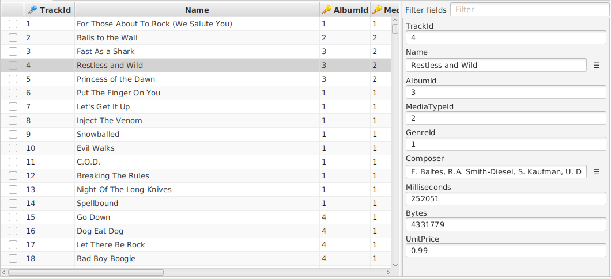

---

layout: default
title: Vertical row view
resource: true
categories: [GUI]
 
---

## Vertical row view

On an open table tab, it is possible to open the so called **Vertical row view**.
Just double-click on a row. 
Also you can just select the row you want to see in detail, press Enter, open the table menu and select **Row details**, or press Ctrl-R. 

The vertical row view appears on the right side of the original table.

The vertical view shows vertically all the fields of the selected row. This is beneficial in the following cases:

- The table contains so **many columns** that it is not possible to see them all at the same time in the table, forcing you to scroll horizontally. The vertical row view can only show a single row, but there is a good chance that it can show all its fields without need to scroll.
- The table contains very **large text fields**, for example LOBs. For a field of this kind only a part of it is visible in the table (normally the first line),  but the entire field is visible in the vertical row view, with the help of  scrollbars. 

The vertical row view can be shown or hidden very easily (it is just needed to press Ctrl-R) and is supposed to help only when there is a need for it, without being annoying.

Additionally it is possible to copy the content of individual fields from the vertical row, differently from the [copy menu](Copy-Data) of the table.

The vertical row displays the whole content of the fields of the row, also when they are big.

### Filter fields

On the top of the view there is a text box, called Filter fields.
Writing on this text box, the view shows only the fields with a name **containing the text**.