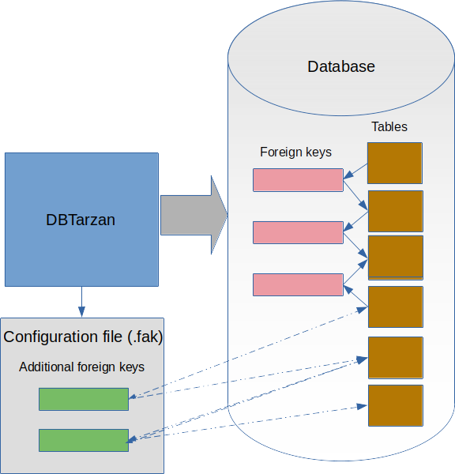

---

layout: default
title: Virtual Foreign Keys
resource: true
categories: [Structure]

---

## Virtual foreign keys

DBTarzan uses the [foreign keys](ForeignKeys) in the database to walk from rows in a table to the related rows in aother one.
But what if the foreign keys are **missing**?
May be the database administrator forgot to add the foreign key and there is no fast way to add it.
Or may be the database just does not support foreign keys (No SQL).

DBTarzan gives the possibility to add the foreign keys yourself, **not in the database** (DBTarzan only reads data from the databse, never writes), but in the **configuration** of DBTarzan.
It will store the keys in a file and load them every time you open the database, so that they can be used again.

The virtual foreign keys will then be used to go from rows of the **from** table to the related ones in the **to** table, but also the **inverse** is possible, so you can go from rows of the **to** table to rows for the **from** table.

