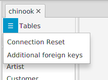
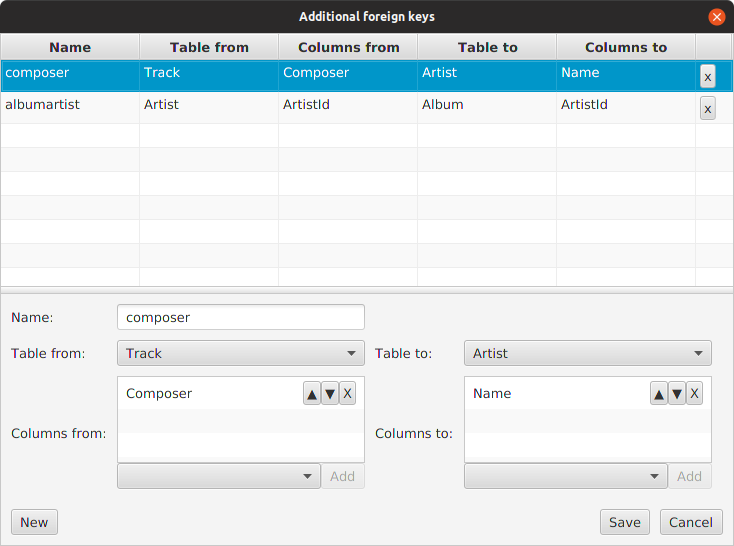
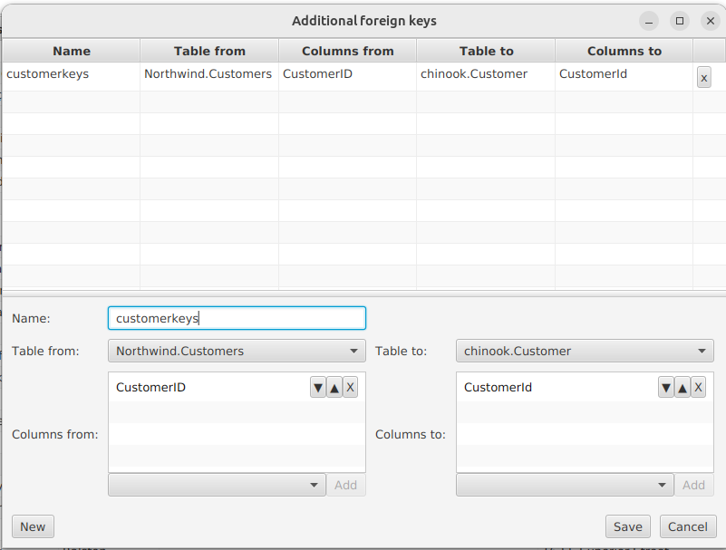

---

layout: default
title: Virtual Foreign Keys Editor
resource: true
categories: [GUI]

---

## Virtual foreign keys editor

To add [virtual foreign keys](VirtualForeignKeys) to DBTarzan's configuration., On the database's Tables menu click **Virtual foreign keys**

This opens the **Virtual foreign keys editor**:

With this editor it is possible to **add, change or delete** the virtual foreign keys.
The editor is composed of:
* A foreign keys **table** on the top.
* The editor for a **single item** in the table.
* Buttons to add rows (**New**), to save the updated list (**Save**) and to just close the editor without saving (**Cancel**), on the bottom.

### The foreign keys table

The foreign keys table shows all foreign keys added until now.

It is possible to remove a row by clicking the **X** button on its right side.

### The single item editor

The single item editor is composed on the follwing parts:
* a text box for the virtual foreign key name on the left top.
* The **from columns list** to select all the columns in the **from** table, on the left.
* The **to columns list** to select all the columns in the **to** table, on the right.

Every time something is changed in the single item editor, the relate row in the foreign keys table gets changed too.

To fill up the content of an virtual foreign key you need to:
* Give it a **name** on the name text box.
* fill up the **from columns list** with the columns of the **from** table that are supposed to be in the foreign key, in the correct order.
* fill up the **to columns list** with the columns of the **to** table that are supposed to be in the foreign key, in the correct order.

To fill up the fields on a column list;

* Select the **database table** on the top combo box (Table from or Table to):
* Add to the list the **columns**, by choosing them from the combo box on the bottom of the list and pressing the **Add** button.

The column list gives also the possibility to:
* **remove** columns (click the **X** button on a list row) 
* **change their order**, by moving them up or down with the other two buttons on each list row.

### The buttons on the bottom

To add a foreign key press the **New** button on the left bottom of the editor.
A new row is added to the foreign keys table, with <NEW> as name and no columns selected. You have then to fill up the new foreign key with the single item editor. 

Pressing **Save** the foreign keys in the table are saved and the editor closed, but only if the foreign keys are **correct**, which means that each foreign key:
* has a proper non-empty name
* has proper non-empty from and to columns, in the same number
* there are no duplications (same name, same from and to columns)

After they are saved, the virtual foreign keys are **checked against the existing database foreign keys**; if they match one or more of them, they are stored anyway (they are not harmful) but an error message is displayed in the log view.    

Pressing **Cancel** the editor is closed without saving.

### Composites

If we are editing the virtual foreign keys of a composite, the editor shows the tables names with their database as prefix, to avoid confusing tables of different databases.

