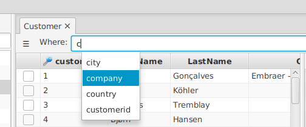
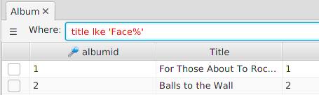

---

layout: default
title: Where clause
resource: true
categories: [GUI]

---

## Where clause

You can select specific rows of the table specifying a **where clause**:

The where clause is equivalent to the one of an  [SQL expression](https://en.wikipedia.org/wiki/Where_(SQL)).

To help you writing the clause, DBTarzan **suggests** you the column names that starts with the letters you are writing.
If you choose one of them, it is appended to the where clause. 
 
Once your where clause is complete, you can query the database with it pressing Enter. 

Errors in the where clause cause the where clause text color to turn red:

 