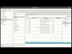

---
# Feel free to add content and custom Front Matter to this file.
# To modify the layout, see https://jekyllrb.com/docs/themes/#overriding-theme-defaults

layout: default
title: Welcome
resource: true
categories: [Welcome]

---

## Welcome to DbTarzan, the database browser

With DBTarzan you can browse the tables of a database:
* using the relations in their [foreign keys](ForeignKeyPanel).
* with [where clauses](Where-clause).

It can also follow the relations among tables of separated databases through [ad hoc additional forign keys](Composites).

Please check the [GUI structure](GUI-Structure) to know how to [use it](Usage).

[Install](Installation) and start DbTarzan and [connect to a database](Connect-to-database). It's easy!

DBTarzan [can't harm your database](Can-I-use-it-with-production-databases) (it never writes) and has been used with production databases.

The following video shows an example of database exploration: 

DBTarzan should work on any relational database with a **JDBC driver** and has been proved to work on these [databases and operating systems](Tested-databases-and-operating-systems).