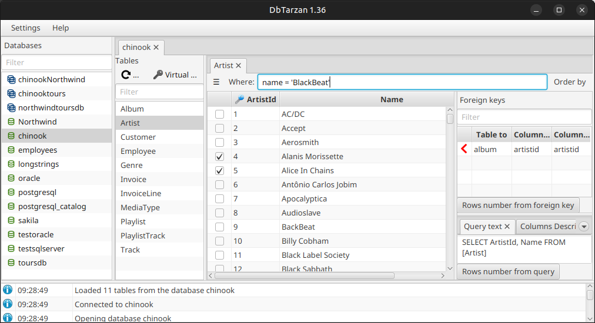

---
# Feel free to add content and custom Front Matter to this file.
# To modify the layout, see https://jekyllrb.com/docs/themes/#overriding-theme-defaults

layout: default
title: Welcome
resource: true
categories: [Welcome]

---

## Welcome to DbTarzan.

With DBTarzan you can browse the tables of a database using the relations in their [foreign keys](ForeignKeys). 

And if the database is missing a foreign key you can [simulate its existence](AdditionalForeignKeysEditor). 

[Install](Installation) and start DbTarzan and [connect to a database](Connect-to-database). It's easy!
Please check the [GUI structure](GUI-Structure) to know how to [use it](Usage).

If things are too slow (databases with complex structures) try to [preload the foreign keys](Foreign-keys-preloading).

DBTarzan [can't harm your database](Can-I-use-it-with-production-databases) (it never writes) and has been used with production databases.

This [video](https://youtu.be/-hR9ZLf3bNY) shows an example of database exploration.

DBTarzan has been proved to work on these [databases and operating systems](Tested-databases-and-operating-systems).